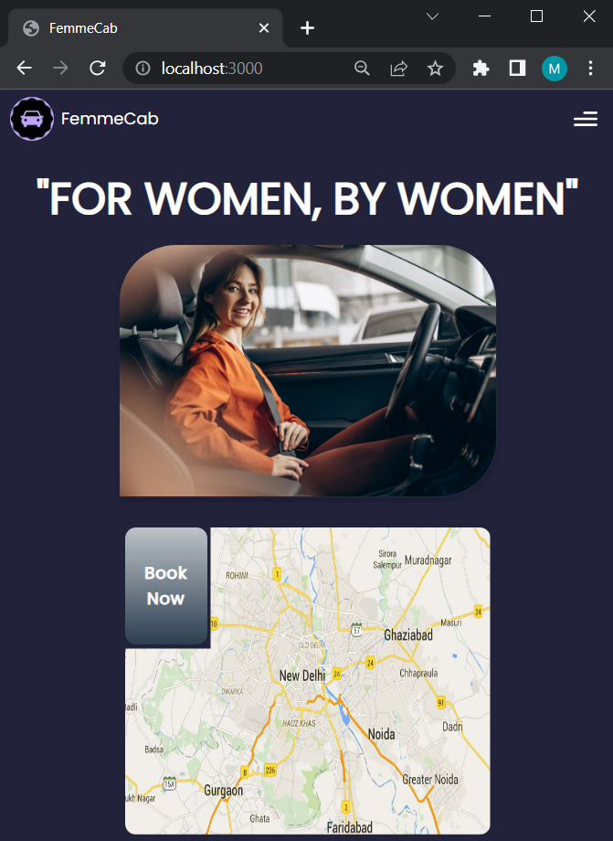

<p align="center">
  <a href="https://github.com/mishikaa/FemmeCab">
    
  </a>

  <h3 align="center">FemmeCab</h3>

  <p align="center">
    A women-only cab booking system 
    <br/>
    <br/>
    .
    <a href="https://github.com/mishikaa/FemmeCab/issues">Report Bug</a>
    .
    <a href="https://github.com/mishikaa/FemmeCab/issues">Request Feature</a>
  </p>
</p>

 
 
 


## Table Of Contents

- [Table Of Contents](#table-of-contents)
- [About](#about-the-project)
- [Built With](#built-with)
- [Getting Started](#getting-started)
  - [Prerequisites](#prerequisites)
  - [Installation](#installation)
- [Contributing](#contributing)
  - [Creating A Pull Request](#creating-a-pull-request)
- [License](#license)
- [Authors](#authors)

## About The Project

ReadIt is a blogging platform designed to provide a platform for users to share and discover engaging content on a wide range of topics. With its 
intuitive user interface and powerful features, ReadIt aims to create a vibrant community where individuals can express their thoughts, learn from 
others, and foster meaningful discussions.

### Home Page


### Mobile View


### Map Page


## Built With

* [React](https://react.dev/)
* [TailwindCSS](https://tailwindcss.com/)
* [JavaScript](https://www.javascript.com/)
* [NodeJs](https://nodejs.org/en/about)
* [ExpressJs](https://expressjs.com/)
* Database: [MongoDB](https://www.mongodb.com/)
* Authentication: [jwt](https://jwt.io/)  [firebase](https://firebase.google.com/?gad=1&gclid=CjwKCAjw-b-kBhB-EiwA4fvKrAnOUFQSEsr7vB5Mx5W1mv3ZGp3RXYFnjoy-TgUmZjQTM_28tj8MoxoCocgQAvD_BwE&gclsrc=aw.ds)


## Getting Started

To get a local copy up and running follow these simple example steps.

### Prerequisites

This program has no pre-requisites

### Installation

1. Clone the repo

```sh
git clone https://github.com/mishikaa/FemmeCab.git
```

2. In the command prompt, enter the following commands(make sure you are in the root directory)

```sh
npm install
```
<br />

3. To run the frontend, enter the following commands
```sh
cd frontend/
```
```sh
npm start
```
The application will start running successfully on [localhost:3000](http://localhost:3000/)

4. To run the backend, enter the following commands
```sh
nodemon backend/index.js
```

## Contributing

Contributions are what make the open source community such an amazing place to be learn, inspire, and create. Any contributions you make are **greatly appreciated**.
* If you have suggestions for adding or removing projects, feel free to [open an issue](https://github.com/mishikaa/FemmeCab/issues/new) to discuss it, or directly create a pull request after you edit the *README.md* file with necessary changes.
* Create individual PR for each suggestion.
* Please also read through the [Code Of Conduct](https://github.com/mishikaa/FemmeCab/blob/main/CODE_OF_CONDUCT.md) before posting your first idea as well.

### Creating A Pull Request

1. Fork the Project
2. Create your Feature Branch (`git checkout -b feature/FeatureName`)
3. Commit your Changes (`git commit -m 'Add some FeatureName'`)
4. Push to the Branch (`git push origin feature/FeatureName`)
5. Open a Pull Request

## License

Distributed under the MPL-2.0 License. See [LICENSE](https://github.com/mishikaa/FemmeCab/blob/main/LICENSE.md) for more information.

## Authors

* **Himanshi** - [Himanshi](https://github.com/Himanshi-023/)
* **Mishika Jaiswal** - [Mishika Jaiswal](https://github.com/mishikaa/)
* **Saakshi Dharmadhikary** - [Saakshi D](https://github.com/Saakshi-D/)
